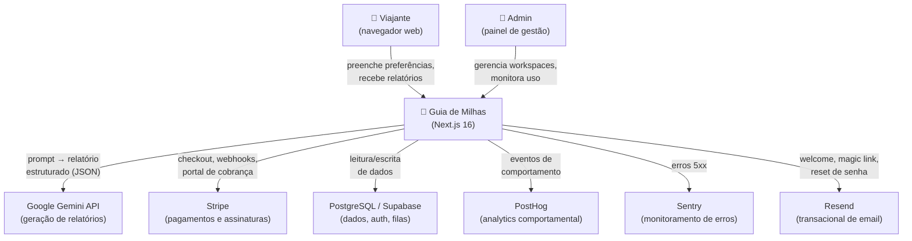
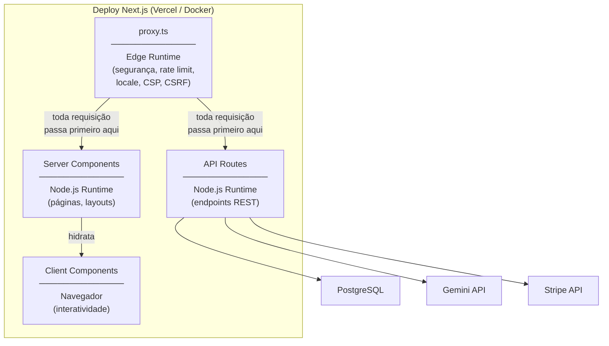
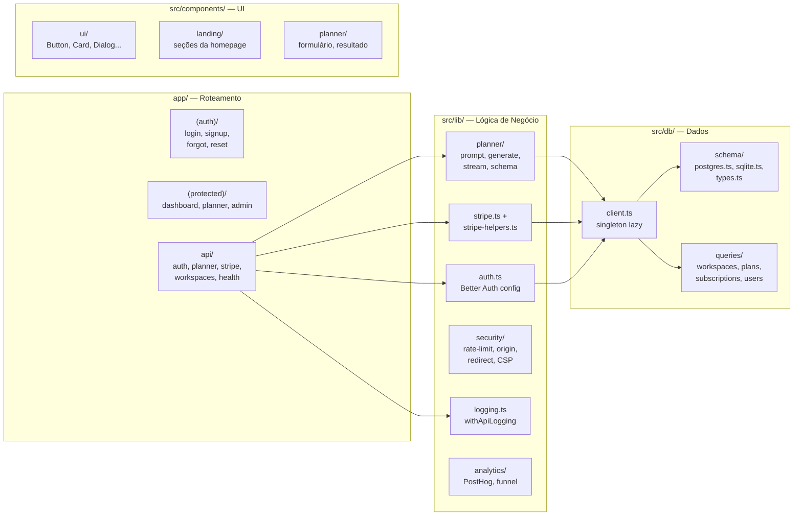
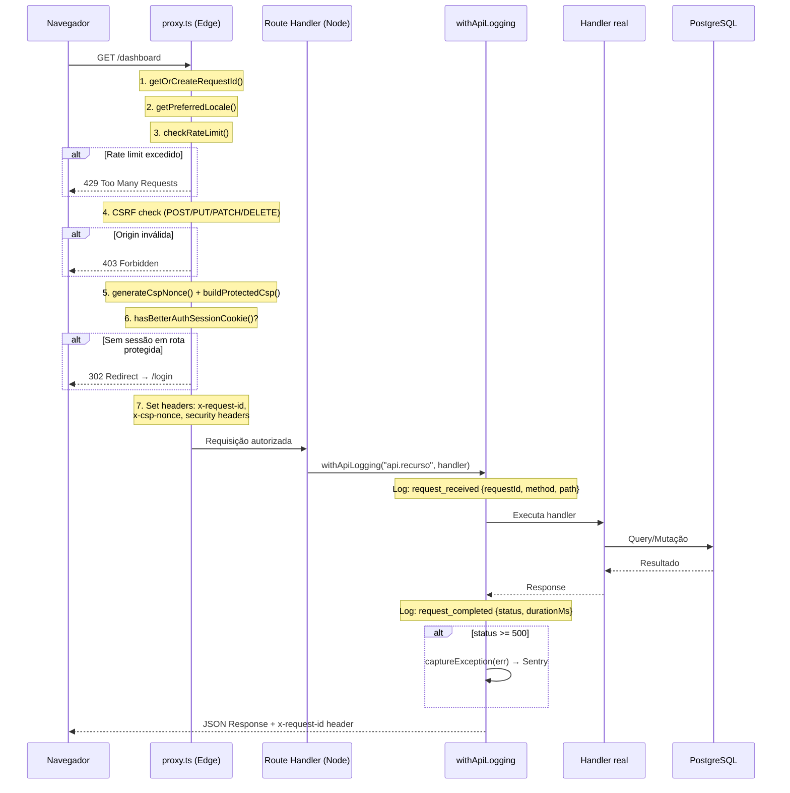
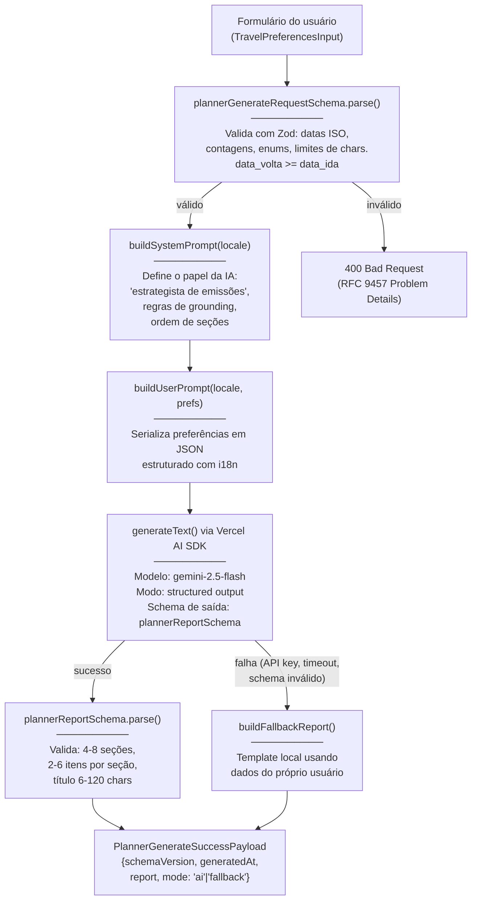
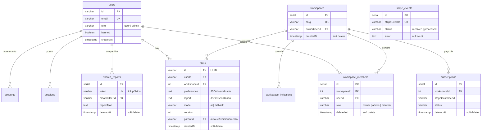
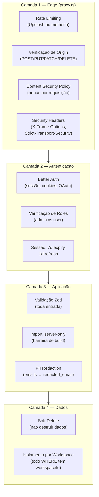

# Guia de Milhas — Entendendo o Codebase

> **Para quem**: devs iniciantes no time.
> **Filosofia**: explicar o _porquê_ de cada decisão, não apenas o _quê_. Se você sabe _por que_ algo existe, consegue modificá-lo sem medo. Se só sabe _o que_ faz, vai ter medo de tocar.

---

## Índice

| #   | Seção                                                                                 | O Que Você Vai Aprender                                    |
| --- | ------------------------------------------------------------------------------------- | ---------------------------------------------------------- |
| 0   | [O Problema Que Resolvemos](#0-o-problema-que-resolvemos)                             | Contexto de negócio — sem isso, o código não faz sentido   |
| 1   | [Visão C4 Nível 1 — Contexto](#1-visão-c4-nível-1--contexto)                          | O sistema e seus vizinhos                                  |
| 2   | [Visão C4 Nível 2 — Containers](#2-visão-c4-nível-2--containers)                      | Os grandes blocos dentro do sistema                        |
| 3   | [Visão C4 Nível 3 — Componentes](#3-visão-c4-nível-3--componentes)                    | Cada módulo e sua responsabilidade                         |
| 4   | [Invariantes do Sistema](#4-invariantes-do-sistema)                                   | Propriedades que NUNCA podem ser violadas                  |
| 5   | [Decisões Arquiteturais (ADRs)](#5-decisões-arquiteturais-adrs)                       | As escolhas difíceis e seus trade-offs                     |
| 6   | [O Pipeline de uma Requisição](#6-o-pipeline-de-uma-requisição)                       | Toda requisição HTTP, do navegador ao banco, passo a passo |
| 7   | [O Pipeline do Planner IA](#7-o-pipeline-do-planner-ia)                               | O core do produto: como a IA gera relatórios               |
| 8   | [Modelo de Dados](#8-modelo-de-dados)                                                 | Todas as tabelas, seus relacionamentos e a lógica por trás |
| 9   | [Camada de Segurança](#9-camada-de-segurança)                                         | Defesa em profundidade, do Edge ao banco                   |
| 10  | [Guia de Navegação — "Preciso Mexer em X"](#10-guia-de-navegação--preciso-mexer-em-x) | Índice orientado a tarefa                                  |
| 11  | [Modos de Falha e Debugging](#11-modos-de-falha-e-debugging)                          | O que quebra, por que quebra, e como investigar            |
| 12  | [Comandos Essenciais](#12-comandos-essenciais)                                        | Seu primeiro dia                                           |
| 13  | [Glossário Preciso](#13-glossário-preciso)                                            | Termos com definição exata                                 |

---

## 0. O Problema Que Resolvemos

Emitir passagens com milhas é um problema de otimização mal-definido: o viajante precisa cruzar datas flexíveis, múltiplos programas de fidelidade, regras de cada companhia, janelas de disponibilidade e restrições de orçamento. Fazer isso manualmente leva horas e exige expertise.

**Guia de Milhas** resolve isso em três passos:

1. O usuário preenche um formulário com suas preferências (datas, origens, destinos, programas de milhas, perfil de viajante)
2. O sistema monta um prompt estruturado e envia ao Google Gemini
3. O Gemini retorna um relatório validado por schema Zod: título, resumo executivo, 4-8 seções com itens acionáveis, e uma lista de premissas assumidas

O resultado é um plano de ação concreto — não uma conversa aberta com chatbot, mas um **artefato estruturado e reproduzível**.

**Por que isso importa para o código**: toda decisão arquitetural no projeto serve a esse fluxo. O multi-tenancy existe porque queremos white-label. O streaming existe porque TTFT < 500ms é uma métrica de produto. O fallback local existe porque o usuário jamais deve ver uma tela vazia.

---

## 1. Visão C4 Nível 1 — Contexto

> _"Quem usa o sistema e com quem ele conversa?"_



**Ponto-chave**: PostgreSQL é a **única** infraestrutura de estado. Não existe Redis, RabbitMQ, S3 para dados críticos. Essa é uma decisão deliberada — veja [ADR-02](#adr-02-postgresql-como-infraestrutura-única).

---

## 2. Visão C4 Nível 2 — Containers

> _"Quais são os processos que compõem o sistema?"_

Na prática, tudo roda dentro de **um único deploy Next.js**. Mas logicamente, existem quatro containers distintos:



**O que diferencia este projeto de um Next.js vanilla**: nós NÃO usamos `middleware.ts`. Em vez disso, usamos `proxy.ts` — que é efetivamente o middleware renomeado para forçar o time a tratá-lo como um pipeline de segurança explícito, não como um "middleware qualquer". Cada função no proxy é uma etapa nomeada e auditável.

---

## 3. Visão C4 Nível 3 — Componentes

> _"Quais módulos existem e o que cada um faz?"_



### Responsabilidade Exata de Cada Módulo

| Módulo        | Arquivo(s) Principal(is)                  | Responsabilidade Única                                                        |
| ------------- | ----------------------------------------- | ----------------------------------------------------------------------------- |
| **Auth**      | `src/lib/auth.ts`                         | Configura Better Auth: email/senha, magic link, social, admin, hooks de banco |
| **Planner**   | `src/lib/planner/` (6 arquivos)           | Validar entrada → construir prompt → chamar Gemini → validar saída → fallback |
| **Stripe**    | `src/lib/stripe.ts` + `stripe-helpers.ts` | Criar clientes, sessões de checkout/portal, processar webhooks, mapear planos |
| **Security**  | `src/lib/security/` (7 arquivos)          | Rate limiting (Upstash/memória), validação de origin, CSP, safe redirects     |
| **Logging**   | `src/lib/logging.ts`                      | HoF que envolve handlers com request-id, timing, log JSON, captura Sentry     |
| **DB Client** | `src/db/client.ts`                        | Singleton lazy com Proxy — resolve Postgres/SQLite/D1 em runtime              |
| **Schema**    | `src/db/schema/`                          | Definição de tabelas dual-dialect, tipos agnósticos, schemas Zod de validação |
| **Queries**   | `src/db/queries/`                         | Operações específicas (CRUD workspace, planos, convites, assinaturas)         |
| **Proxy**     | `proxy.ts` (raiz)                         | Pipeline Edge: request-id → locale → rate limit → CSRF → CSP → auth redirect  |

---

## 4. Invariantes do Sistema

> _Invariante = propriedade que deve ser verdadeira em todos os estados possíveis do sistema. Se for violada, temos um bug de segurança ou corrupção de dados._

### INV-01: Sem Hard Delete

```
∀ tabelas T com coluna deletedAt:
  NUNCA executar DELETE FROM T.
  Sempre: UPDATE T SET deletedAt = now() WHERE ...
```

**Por quê**: recuperabilidade, auditoria, e conformidade. Em um produto com dados financeiros (assinaturas Stripe) e dados gerados por IA (relatórios), destruir registros é irreversível e inaceitável.

**Como verificar**: se você vê `db.delete(` em qualquer lugar do código (exceto em seeds/testes), é um bug.

**Como filtrar**: toda query deve incluir `isNull(tabela.deletedAt)`.

---

### INV-02: Isolamento de Workspace

```
∀ queries Q que leem ou escrevem dados de workspace:
  Q DEVE conter filtro WHERE workspaceId = <id do workspace atual>
```

**Por quê**: workspaces são tenants isolados. Um usuário do Workspace A nunca deve ver, modificar ou inferir a existência de dados do Workspace B. Violar isso é um vazamento de dados entre clientes.

**Exceção**: rotas de admin global (acessíveis apenas por `role = 'admin'`).

---

### INV-03: Parâmetros de Rota São Promises

```
∀ componentes de página P com params:
  typeof params === 'Promise' → DEVE usar await
```

**Por quê**: Next.js 16 mudou a API de route params para Promise. Acessar `params.id` diretamente compila mas quebra em runtime. Este é o erro mais comum de devs vindos do Next.js 14/15.

---

### INV-04: Módulos Server-Only Nunca Vazam

```
∀ módulos M que acessam DB, secrets, ou APIs server-side:
  M DEVE ter import 'server-only' na primeira linha
```

**Por quê**: se um Client Component importar acidentalmente `auth.ts` ou `client.ts`, o build vai tentar bundlar secrets, drivers de banco, e código Node.js para o navegador. O import `'server-only'` transforma isso em um erro de build imediato em vez de um bug sutil em produção.

---

### INV-05: Todo Endpoint API é Logado

```
∀ export async function POST/GET/PUT/DELETE em app/api/:
  handler DEVE ser envolvido por withApiLogging(prefixo, handler)
```

**Por quê**: sem isso, erros 500 são silenciosos — não aparecem no Sentry, não têm request-id, não registram duração. Debugging se torna impossível.

---

## 5. Decisões Arquiteturais (ADRs)

> _Cada ADR explica: o contexto, a decisão, as alternativas rejeitadas, e as consequências._

### ADR-01: Better Auth em vez de NextAuth/Supabase Auth

|                             |                                                                                                                                                                         |
| --------------------------- | ----------------------------------------------------------------------------------------------------------------------------------------------------------------------- |
| **Contexto**                | Precisávamos de autenticação com email/senha, magic links, OAuth, e roles de admin. A migração do NextAuth já havia acontecido.                                         |
| **Decisão**                 | Better Auth com adapter Drizzle, plugins `admin` e `magicLink`.                                                                                                         |
| **Alternativas rejeitadas** | **NextAuth**: API instável entre versões, difícil de customizar hooks de banco. **Supabase Auth**: acoplaria auth ao Supabase, impossibilitando rodar local com SQLite. |
| **Trade-off aceito**        | Better Auth é menos popular (menos Stack Overflow), mas o código-fonte é legível e testável.                                                                            |
| **Consequência**            | Auth funciona identicamente em Postgres e SQLite, permitindo dev local sem Supabase.                                                                                    |

---

### ADR-02: PostgreSQL Como Infraestrutura Única

|                      |                                                                                                                                                                                                                                      |
| -------------------- | ------------------------------------------------------------------------------------------------------------------------------------------------------------------------------------------------------------------------------------ |
| **Contexto**         | O PRD original mencionava "filas" e "cache". A tentação é adicionar Redis e RabbitMQ.                                                                                                                                                |
| **Decisão**          | PostgreSQL para _tudo_: dados relacionais, sessões, e futuramente filas (`SKIP LOCKED`). Zero Redis.                                                                                                                                 |
| **Por quê**          | Cada componente de infraestrutura é um modo de falha. Redis caindo = auth degradada. RabbitMQ = mais um serviço para monitorar, escalar, versionar. Um único Postgres bem dimensionado cobre nossas necessidades até 10k concurrent. |
| **Quando reavaliar** | Quando load testing provar que Postgres não aguenta a carga. Não antes.                                                                                                                                                              |

---

### ADR-03: proxy.ts em vez de middleware.ts

|                  |                                                                                                                                                                                                                                     |
| ---------------- | ----------------------------------------------------------------------------------------------------------------------------------------------------------------------------------------------------------------------------------- |
| **Contexto**     | Next.js usa `middleware.ts` para interceptação de requisições. O nome genérico incentiva colocar _tudo_ lá: auth, redirect, A/B testing, logging.                                                                                   |
| **Decisão**      | Renomear para `proxy.ts`. Tratar como pipeline de segurança com funções nomeadas, cada uma fazendo exatamente uma coisa: `withRequestId()`, `getPreferredLocale()`, `buildProtectedCsp()`, `checkRateLimit()`, `isAllowedOrigin()`. |
| **Por quê**      | Auditabilidade. Cada etapa é grep-ável. Quando o time de segurança pergunta "como funciona o CSRF?", a resposta é `proxy.ts:getRequestOriginForCsrf()`.                                                                             |
| **Consequência** | Não podemos usar o nome `middleware.ts` (AGENTS.md proíbe explicitamente).                                                                                                                                                          |

---

### ADR-04: Drizzle ORM Multi-Dialect com Proxy Lazy

|                      |                                                                                                                                                                                                                                 |
| -------------------- | ------------------------------------------------------------------------------------------------------------------------------------------------------------------------------------------------------------------------------- |
| **Contexto**         | Precisamos suportar: Postgres (produção), SQLite (dev local), D1 (edge futuro).                                                                                                                                                 |
| **Decisão**          | Schema duplicado (`postgres.ts` + `sqlite.ts`) com tipos compartilhados (`types.ts`). Client usa Proxy para inicialização lazy.                                                                                                 |
| **Por quê**          | A alternativa seria um ORM que abstrai dialetos (Prisma). Mas Prisma gera um cliente que não funciona em Edge e a migração é opaca. Drizzle gera SQL legível, e o schema duplicado nos força a manter portabilidade consciente. |
| **Trade-off aceito** | Mudanças de schema exigem editar dois arquivos. `pnpm db:schema-parity` verifica se estão sincronizados.                                                                                                                        |
| **Lazy Proxy**       | O `client.ts` usa `new Proxy()` para que `import { db }` NUNCA dispare uma conexão. A conexão só é aberta quando `db.query.*` é chamado. Isso permite que `next build` importa o módulo sem crash mesmo sem `DATABASE_URL`.     |

---

### ADR-05: Fallback Local para o Planner

|                  |                                                                                                                                                                                         |
| ---------------- | --------------------------------------------------------------------------------------------------------------------------------------------------------------------------------------- |
| **Contexto**     | O Gemini pode falhar (API key ausente em dev, timeout, resposta fora do schema).                                                                                                        |
| **Decisão**      | Se Gemini falha, `buildFallbackReport()` gera um relatório local baseado nos próprios dados do usuário + templates estáticos. O campo `mode` na resposta indica `'ai'` ou `'fallback'`. |
| **Por quê**      | O usuário nunca deve ver uma tela vazia. Mesmo um relatório template tem mais valor que um erro 500.                                                                                    |
| **Consequência** | O frontend DEVE checar `mode` e pode exibir um aviso quando `mode === 'fallback'`.                                                                                                      |

---

### ADR-06: Rate Limiting com Fallback Gracioso

|              |                                                                                                                                                                                                 |
| ------------ | ----------------------------------------------------------------------------------------------------------------------------------------------------------------------------------------------- |
| **Contexto** | Precisamos de rate limiting no Edge (proxy.ts), mas não queremos dependência hard de Redis.                                                                                                     |
| **Decisão**  | Se Upstash Redis está configurado, usa fixed-window distribuído. Se não, fallback para `Map` in-memory por instância Edge. Se Upstash está configurado mas falha (rede), fallback para memória. |
| **Por quê**  | Rate limiting deve ser uma **proteção, não um ponto de falha**. Se o rate limiter cair, preferimos servir tráfego sem limite a rejeitar 100% das requisições.                                   |

---

## 6. O Pipeline de uma Requisição

> _Toda_ requisição HTTP (página ou API) passa por esta sequência exata:



**Implicações práticas**:

- Todo response tem header `x-request-id`. Use esse ID para correlacionar logs.
- Rate limiting acontece ANTES da autenticação — um atacante fazendo brute-force é bloqueado sem tocar o banco.
- CSP nonce é gerado por requisição — scripts inline sem nonce são bloqueados pelo navegador.

---

## 7. O Pipeline do Planner IA

Este é o fluxo mais importante do sistema — é o produto.



### Detalhes que importam

1. **Structured Output**: não pedimos texto livre ao Gemini. Pedimos JSON que obedeça `plannerReportSchema`. O SDK usa function calling internamente para forçar o schema.

2. **Validação dupla**: a entrada do usuário é validada com Zod. A saída da IA também é validada com Zod. Nenhum dado não-validado cruza as fronteiras do sistema.

3. **Erros seguem RFC 9457**: respostas de erro usam o formato Problem Details (`type`, `title`, `status`, `detail`, `instance`, `requestId`). Veja `api-contract.ts`.

4. **i18n nos prompts**: `buildSystemPrompt('pt-BR')` gera instruções em português. Isso não é cosmético — o idioma do prompt afeta diretamente a qualidade da saída da IA.

---

## 8. Modelo de Dados



### Decisões notáveis no modelo

| Decisão                                         | Raciocínio                                                                                                                                                                              |
| ----------------------------------------------- | --------------------------------------------------------------------------------------------------------------------------------------------------------------------------------------- |
| `plans.preferences` é `text` (JSON serializado) | Preferências são um snapshot imutável. Não precisamos fazer queries por campos internos. Serializar evita 15+ colunas.                                                                  |
| `plans.version` + `plans.parentId`              | Permite versionamento: gerar nova versão de um plano sem perder o original.                                                                                                             |
| `stripe_events.status`                          | Idempotência: antes de processar um evento Stripe, marcamos `received`. Se o processamento falha, `error` é preenchido. Re-entrega do webhook encontra o registro e sabe que já tentou. |
| `workspace_invitations.token`                   | Token opaco para convites. É o equivalente a um link tipo `app.com/invite?token=abc123`.                                                                                                |
| Todas as tabelas de negócio têm `deletedAt`     | INV-01.                                                                                                                                                                                 |

---

## 9. Camada de Segurança

A segurança é implementada em **camadas** (defense in depth). Cada camada opera independentemente:



**Por que rate limiting vem antes de auth**: se um atacante fizer brute-force no login, o rate limit o bloqueia sem que o request jamais toque o banco de dados. Isso evita amplificação de custo.

**CSRF**: para métodos mutáveis (POST/PUT/PATCH/DELETE), o proxy verifica que o header `Origin` ou `Referer` é um origin permitido. Se não for, retorna 403 imediatamente.

---

## 10. Guia de Navegação — "Preciso Mexer em X"

> _Use esta tabela quando receber uma task. Ela diz exatamente quais arquivos olhar._

| Preciso...                               | Comece por                                | Depois leia                                                 |
| ---------------------------------------- | ----------------------------------------- | ----------------------------------------------------------- |
| Adicionar campo no formulário do planner | `src/lib/planner/schema.ts`               | `prompt.ts`, `generate-report.ts`, componente de formulário |
| Mudar o prompt da IA                     | `src/lib/planner/prompt.ts`               | `generate-report.ts` (para entender o fallback)             |
| Criar nova rota de API                   | `app/api/<recurso>/route.ts`              | `src/lib/logging.ts` (wrapping), `src/lib/http.ts` (error)  |
| Adicionar tabela no banco                | `src/db/schema/postgres.ts` + `sqlite.ts` | `types.ts`, `client.ts` (exportar), `pnpm db:schema-parity` |
| Mudar regras de auth                     | `src/lib/auth.ts`                         | `proxy.ts` (redirecionamentos), `app/api/auth/`             |
| Adicionar rota protegida                 | `app/(protected)/`                        | `proxy.ts` (verifica cookie de sessão)                      |
| Mexer em pagamentos                      | `src/lib/stripe-helpers.ts`               | `src/lib/stripe.ts`, `app/api/stripe/webhooks/`             |
| Adicionar tradução                       | `src/lib/messages.ts`                     | `src/content/landing.ts`, `src/lib/planner/prompt.ts`       |
| Debugar erro 500                         | Logs → busque pelo `requestId`            | `src/lib/logging.ts`, Sentry                                |
| Mexer em headers de segurança            | `proxy.ts`                                | `src/lib/security/`                                         |
| Adicionar feature flag                   | `src/components/experiments/`             | Painel do GrowthBook                                        |
| Rodar testes                             | `pnpm test` (Vitest)                      | `pnpm test:e2e` (Playwright)                                |

---

## 11. Modos de Falha e Debugging

> _O que vai quebrar, e como investigar._

### Falha: "O relatório não gera"

| Sintoma                    | Causa provável                   | Como investigar                                          |
| -------------------------- | -------------------------------- | -------------------------------------------------------- |
| 400 Bad Request            | Input inválido (Zod)             | Leia o campo `detail` do Problem Details na resposta     |
| 200 OK, `mode: 'fallback'` | Gemini falhou ou API key ausente | Verifique `GOOGLE_GENERATIVE_AI_API_KEY` no `.env.local` |
| 500 Internal Server Error  | Erro não-capturado               | Busque `requestId` nos logs ou no Sentry                 |
| 429 Too Many Requests      | Rate limit no proxy              | Espere `retryAfterSeconds` indicado no response          |

### Falha: "Não consigo logar"

| Sintoma                                                       | Causa provável                                                            |
| ------------------------------------------------------------- | ------------------------------------------------------------------------- |
| Redirect infinito `/login` → `/login`                         | Cookie de sessão não está sendo setado (verifique `BETTER_AUTH_BASE_URL`) |
| "Missing BETTER_AUTH_SECRET"                                  | `.env.local` não configurado (copie `.env.example`)                       |
| Login funciona mas redirect vai para `/` em vez de `/planner` | Verifique `proxy.ts:hasBetterAuthSessionCookie()`                         |

### Falha: "Build quebra ao importar módulo de servidor"

| Sintoma                                    | Causa provável                                                                                                                                                     |
| ------------------------------------------ | ------------------------------------------------------------------------------------------------------------------------------------------------------------------ |
| "Module not supported in client component" | Um componente `'use client'` está importando (direta ou transitivamente) um módulo com `import 'server-only'`                                                      |
| **Como resolver**                          | Rastreie a cadeia de imports até encontrar o Client Component que importa o módulo server-only. Separe os dados (passe como props) ou crie um wrapper server-side. |

### Falha: "Schema parity check falha"

```bash
pnpm db:schema-parity  # Compara postgres.ts vs sqlite.ts
```

Se falha, significa que você editou `postgres.ts` mas esqueceu de replicar em `sqlite.ts` (ou vice-versa). É esperado — edite o outro arquivo para ficar em paridade.

---

## 12. Comandos Essenciais

### Primeiro Dia

```bash
# 1. Instalar
pnpm install

# 2. Configurar ambiente
cp .env.example .env.local
# Edite .env.local com suas chaves

# 3. Criar banco local (SQLite)
pnpm db:push:sqlite
pnpm db:seed

# 4. Rodar
pnpm dev
# → http://localhost:3000
```

### Dia a Dia

| Comando                 | Quando usar                                          |
| ----------------------- | ---------------------------------------------------- |
| `pnpm dev`              | Desenvolvimento                                      |
| `pnpm lint`             | Antes de commitar                                    |
| `pnpm type-check`       | Depois de mudar tipos                                |
| `pnpm test`             | Testes unitários (Vitest)                            |
| `pnpm test:e2e`         | Testes end-to-end (Playwright)                       |
| `pnpm verify`           | Antes de abrir PR (lint + type + test + build + e2e) |
| `pnpm db:studio`        | Explorar banco visualmente                           |
| `pnpm db:schema-parity` | Depois de editar schema                              |

---

## 13. Glossário Preciso

| Termo                           | Definição exata neste projeto                                                                                                                  |
| ------------------------------- | ---------------------------------------------------------------------------------------------------------------------------------------------- |
| **App Router**                  | Sistema de roteamento do Next.js onde a estrutura de pastas em `app/` define as URLs. Não confundir com Pages Router (legado).                 |
| **Better Auth**                 | Biblioteca de autenticação usada. Gerencia sessões, OAuth, magic links e roles. Config em `src/lib/auth.ts`.                                   |
| **Client Component**            | Componente React executado no navegador. Requer `'use client'` no topo. Pode usar hooks (`useState`, `useEffect`). Não pode acessar DB.        |
| **Drizzle ORM**                 | ORM usado para queries tipadas. Gera SQL legível. Schema definido em `src/db/schema/`.                                                         |
| **Edge Runtime**                | Ambiente leve de execução JavaScript da Vercel. Usado por `proxy.ts`. NÃO tem acesso a APIs Node.js completas (sem `fs`, sem `child_process`). |
| **Fallback**                    | Relatório gerado localmente quando o Gemini falha. Indicado por `mode: 'fallback'` na resposta.                                                |
| **HoF (Higher-Order Function)** | Função que recebe ou retorna outra função. `withApiLogging()` é uma HoF — recebe seu handler e retorna um handler com logging.                 |
| **Invariante**                  | Propriedade que deve ser verdadeira em todos os estados. Seção 4 lista as invariantes deste sistema.                                           |
| **Lazy Singleton**              | Padrão onde o objeto (`db`) é criado na primeira chamada, não no import. Implementado via `Proxy` em `client.ts`.                              |
| **Magic Link**                  | Login via link clicável enviado por email. Sem senha. Expira em 5 minutos.                                                                     |
| **Problem Details**             | RFC 9457. Formato padrão para respostas de erro JSON: `{type, title, status, detail, instance}`. Veja `api-contract.ts`.                       |
| **Proxy**                       | Neste projeto, `proxy.ts` = pipeline de segurança que intercepta TODA requisição antes de chegar ao handler. NÃO é um proxy reverso.           |
| **Server Component**            | Componente React executado no servidor. Padrão no Next.js 16. Pode acessar DB diretamente. Não pode usar hooks de estado.                      |
| **Soft Delete**                 | Marcar registro com `deletedAt = now()` em vez de `DELETE FROM`. Obrigatório (INV-01).                                                         |
| **Structured Output**           | Modo do Gemini onde a IA é forçada a retornar JSON conforme um schema específico, em vez de texto livre.                                       |
| **Workspace**                   | Unidade de isolamento multi-tenant. Cada workspace tem seus próprios membros, planos e assinatura.                                             |
| **Zod**                         | Biblioteca de validação de schemas em runtime. Usada para validar entrada de API E saída da IA.                                                |

---

> **Quando estiver em dúvida sobre onde começar**: abra o arquivo de rota (`app/.../page.tsx` ou `app/api/.../route.ts`), siga os imports. Cada import te leva uma camada mais fundo. Rota → Lógica de Negócio → Dados. Essa é a espinha dorsal do sistema.
