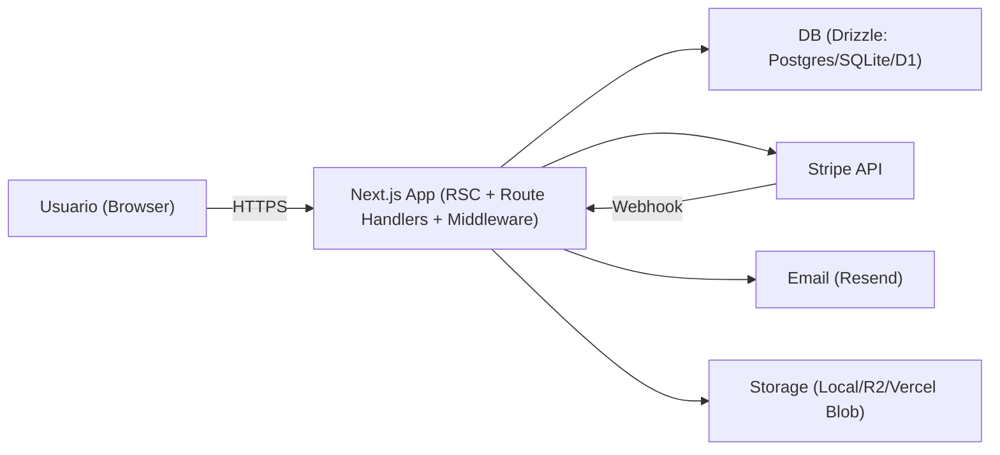

# Relatorio de Revisao de Seguranca (Next.js) - 2026-02-06

Repo: `/Users/mneves/dev/nextjs-bootstrapped-shipped`

## 0) Resumo executivo (TL;DR)

Este repo agora esta num patamar bom de seguranca "baseline": os maiores riscos praticos em apps Next.js (open redirect, SSRF por `fetch()` server-side, XSS em `` pode quebrar contexto e executar HTML/JS.
- Evidencia:
  - Escape: `src/lib/security/safe-json.ts:7-13`
  - Uso em JSON-LD: `src/components/json-ld.tsx:10-14`
- Mudanca aplicada:
  - Serializacao segura para contexto `<script>` (escape de `<`, `>`, `&`).
- Como validar:
  - Testes: `src/lib/__tests__/safe-json.test.ts`.

### [H-005] CSRF em rotas de mutacao `/api/*` (MITIGADO)

- Severidade: Alta (em apps com cookie auth)
- Impacto: requests cross-site podem acionar mutacoes se o browser enviar cookies.
- Evidencia: `src/middleware.ts:114-130`
- Mudanca aplicada:
  - Fetch Metadata: bloqueia `sec-fetch-site: cross-site`.
  - Origin allowlist: exige `Origin` e valida contra origem canonica.
  - Excecoes intencionais: `/api/auth/*` e `/api/stripe/webhook`.
- Como validar:
  1. Testar POST cross-site sem Origin correto e confirmar 403.
  2. Garantir que `NEXT_PUBLIC_APP_URL` (ou `BETTER_AUTH_BASE_URL`) esta correto em producao.

### [M-006] Rate limiting para brute force / abuso em auth (MITIGADO; ainda nao 10/10)

- Severidade: Media
- Impacto: tentativa de brute force e abuso de endpoints de auth.
- Evidencia: `src/middleware.ts:132-150`
- Mudanca aplicada:
  - Rate limit best-effort (30 req / 10 min / IP) em `/api/auth` POST.
- Limitacao (importante):
  - Em serverless/edge multi-instancia, isso nao e uma garantia forte.
- Como validar:
  - Repetir requests e observar 429 + `Retry-After`.

### [M-007] Headers de seguranca baseline (IMPLEMENTADO)

- Severidade: Media (defesa em profundidade)
- Evidencia: `next.config.ts:11-53`
- Mudanca aplicada:
  - `nosniff`, `referrer-policy`, `X-Frame-Options`, `COOP`, `Permissions-Policy`, etc.
  - CSP minimalista global para compatibilidade (`frame-ancestors`, `base-uri`, `object-src`, `form-action`).
- Como validar:
  - Verificar headers reais no deploy (curl/DevTools).

### [M-008] CSP estrita com nonce em paginas protegidas (IMPLEMENTADO)

- Severidade: Media (defesa em profundidade contra XSS, principalmente em paginas com dados sensiveis)
- Evidencia: `src/middleware.ts:14-40,161-186`
- Mudanca aplicada:
  - Para `/dashboard/*` e `/admin/*`, gera nonce por request e injeta CSP estrita (com `strict-dynamic`).
  - Define `Cache-Control: no-store` para evitar cache de HTML personalizado.
- Como validar:
  1. Abrir `/dashboard` e confirmar CSP com `nonce-...` no response.
  2. Confirmar que scripts do Next carregam normalmente (sem violacoes CSP no console).

### [M-009] Stripe return URLs baseadas em origem canonica (RESOLVIDO)

- Severidade: Media
- Impacto: return URLs derivadas de headers sao desnecessarias e podem causar redirects inesperados em setups/proxies ruins.
- Evidencia:
  - Origem canonica: `src/lib/security/origin.ts:17-35`
  - Uso nos endpoints Stripe:
    `app/api/stripe/checkout/route.ts:79-86`,
    `app/api/stripe/portal/route.ts:48-52`,
    `app/api/stripe/payment/route.ts:46-52`
- Mudanca aplicada:
  - Em producao, falha fechado se a origem canonica nao estiver configurada.
- Como validar:
  - Em prod sem `NEXT_PUBLIC_APP_URL`, endpoints devem falhar (500) ao tentar montar URLs.

### [M-010] Convites: binding por email + aceite atomico/idempotente (RESOLVIDO)

- Severidade: Media
- Impacto:
  - Sem binding, token pode ser suficiente para entrar (se token vazar).
  - Sem atomicidade, ha TOCTOU contra revogacao/expiracao e corridas de aceite.
- Evidencia:
  - Binding email: `app/api/invitations/accept/route.ts:50-53`
  - Aceite atomico (update com `acceptedAt` + insert idempotente):
    `src/db/queries/invitations.ts:105-163`
- Mudanca aplicada:
  - Token sozinho nao basta: email da sessao deve bater com email do convite.
  - Aceite numa transacao com update condicional + insert idempotente (unique constraint).
- Como validar:
  1. Tentar aceitar convite com outra conta e confirmar 403.
  2. Rodar duas aceitacoes concorrentes e confirmar idempotencia.

### [M-011] Auth: base URL explicita em producao + segredo forte (IMPLEMENTADO)

- Severidade: Media
- Evidencia:
  - Base URL fail-closed em prod: `src/lib/auth.ts:104-126`
  - Segredo minimo 32 chars: `src/lib/auth.ts:128-141`
  - `trustedOrigins`: `src/lib/auth.ts:44`
- Mudanca aplicada:
  - Evita "adivinhar" base URL e reduz risco de problemas por proxy/host header.
  - Reduz risco de segredo fraco.
- Como validar:
  - Rodar em prod sem `BETTER_AUTH_BASE_URL` e confirmar erro (fail-closed).

### [M-012] Upload de avatar: validacao de MIME + magic bytes + limite de tamanho (IMPLEMENTADO)

- Severidade: Media
- Evidencia: `app/api/users/avatar/route.ts`
- Mudanca aplicada:
  - Limite 2MB, allowlist MIME, e checagem de magic bytes por tipo.
  - Keys em `avatars/<userId-sanitizado>/<uuid>.<ext>`.
- Como validar:
  - Enviar arquivo com `type=image/png` mas conteudo nao-PNG e confirmar 400.

### [M-013] Multi-tenant RBAC: protecao extra para "owner" (IMPLEMENTADO)

- Severidade: Media (integridade / administracao)
- Problema evitado:
  - Admin removendo/demovendo owner pode "brickar" o workspace e/ou criar situacoes de takeover.
- Evidencia: `app/api/workspaces/[id]/members/route.ts:85-112,152-182`
- Mudanca aplicada:
  - Role `owner` nao pode ser atribuido via PATCH; owner nao pode ser removido via DELETE; owner nao pode se auto-demover por role.

### [L-014] Supply chain e SAST/secret scanning (IMPLEMENTADO)

- Severidade: Baixa a Media (prevencao de regressao)
- Evidencia:
  - `pnpm audit --prod` no CI: `.github/workflows/ci.yml:51-53`
  - CodeQL agendado: `.github/workflows/codeql.yml:1-32`
  - Dependabot: `.github/dependabot.yml:1-18`
  - Secret scanning com Gitleaks (SARIF): `.github/workflows/secret-scan.yml:1-38`

## 4) Riscos residuais e o que falta para 10/10

1. **Rate limiting "real" (P0)**:
   - Trocar o store em memoria por Redis/Upstash/etc e aplicar por IP + por usuario + por rota critica.
2. **Ownership transfer explicito (P0/P1)**:
   - Hoje owner e imutavel por API. Para produto serio: criar endpoint de transferencia que atualiza `workspaces.ownerUserId` e roles numa transacao unica.
3. **CSP mais forte em rotas publicas (P1)**:
   - Hoje e minimalista por compatibilidade com SSG. Um 10/10 teria CSP estrita mais ampla, mas isso exige garantir nonces em paginas dinamicas e evitar inline scripts sem nonce.
4. **DAST / validacao em deploy (P1)**:
   - Confirmar headers reais, cookies reais, e comportamento real (principalmente em Vercel) com testes automatizados.
5. **Observabilidade de seguranca (P2)**:
   - Logs estruturados + alertas para 401/403/429 anormais, convites, e eventos Stripe falhando.

## 5) Como validar (incluindo React DevTools)

### 5.1 Validacao automatizada (local/CI)

- `pnpm lint`
- `pnpm type-check`
- `pnpm test`
- `pnpm build`
- `pnpm audit --prod`

### 5.2 Validacao manual rapida (runtime)

- Open redirect: tentar `callbackUrl` externo e confirmar fallback interno.
- `/api/files`: tentar keys fora do allowlist e confirmar 400; e confirmar 404 quando provider != local.
- Stripe: confirmar que return URLs usam origem canonica.

### 5.3 React Developer Tools (anti-vazamento no client)

Use o React DevTools para garantir que voce nao esta acidentalmente passando informacao sensivel para Client Components.

Doc: `https://react.dev/learn/react-developer-tools`

Checklist:

- Inspecionar componentes de `/dashboard/*` e procurar em props/state:
  - tokens (session token, reset token, magic link token),
  - segredos (STRIPE_SECRET_KEY, RESEND_API_KEY, etc),
  - PII excessiva (ex: emails/IDs desnecessarios em componentes que nao precisam).
- Confirmar que apenas env vars `NEXT_PUBLIC_*` aparecem no bundle do browser.
- Se algo sensivel aparece em props/state, tratar como bug de arquitetura (mover para Server Components/Route Handlers, ou passar apenas IDs/flags minimos).

## 6) Critica de primeiros principios (o que eu faria diferente se tivesse mais tempo)

- **Nao confiar em headers de request para decisoes de seguranca em prod**:
  - Eu ja falhei fechado para origem canonica em prod (`resolveAppOrigin`) e Origin allowlist no middleware. Isso e correto.
- **Minimizar superfice publica**:
  - A decisao de limitar `/api/files` a storage local e allowlist de prefixos reduz classes inteiras de bugs (SSRF/IDOR por key).
- **Provar invariantes multi-tenant**:
  - O passo alem seria modelar "owner" como conceito unico (ownerUserId) e manter roles sem `owner`, com migracao. Eu optei por hardening minimalista via API para nao exigir migracao agora.
- **CSP estrita em todo lugar**:
  - Eu limitei a CSP estrita a rotas protegidas para nao quebrar SSG e runtime. Um 10/10 exigiria desenho intencional de scripts e nonces para mais rotas.
