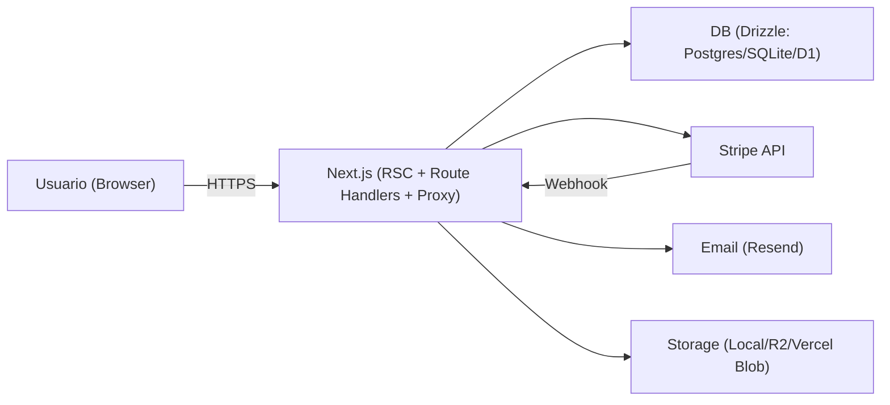

# Revisao de Seguranca (Next.js 16 / React 19) - Atualizado em 2026-02-09

Repo: `/Users/mneves/dev/nextjs-bootstrapped-shipped`

## 0) Resumo executivo (direto ao ponto)

Este repo esta com um baseline forte de seguranca para um app Next.js moderno (App Router):

- Superficies criticas tratadas por desenho: redirects, fetch server-side, arquivos, cookies/sessao, multi-tenant (RBAC), billing (Stripe).
- Defesas em profundidade: CSP com nonce em rotas sensiveis, headers baseline, validacao de input em rotas, CI com audit + SAST + secret scanning.

O que ainda separa de um 10/10 "operacional" (na pratica, em producao) e principalmente observabilidade + validacao em runtime (DAST/headers/cookies reais no deploy) e controles externos (WAF/CDN/rate limit global). O codigo ja suporta rate limiting distribuido se voce configurar Upstash.

Status (gates locais):

- `pnpm lint`: OK
- `pnpm type-check`: OK
- `pnpm test`: OK
- `pnpm build`: OK
- `pnpm audit --prod`: OK (sem vulnerabilidades conhecidas)
- `PW_FULL=1 pnpm test:e2e`: OK (matriz completa Playwright)
- `gitleaks git --redact`: OK (sem leaks no historico)
- DAST-lite: OK (headers/cookies basicos validados por E2E em `e2e/security-headers.e2e.ts`)
  - Execucao externa (preview/staging): `.github/workflows/dast.yml` (workflow_dispatch)

## 1) Metodologia (padrao de industria) e referencias

Eu tratei o problema como "engenharia de seguranca", nao como uma lista aleatoria de checks:

1. Modelo de ameacas: ativos, trust boundaries e superfice exposta.
2. Cobertura sistematica: OWASP Top 10 (taxonomia) + OWASP ASVS (requisitos verificaveis).
3. SDLC e supply chain: NIST SSDF + SAST + secret scanning + Dependabot.
4. Validacao de "nao vazar no client": React DevTools (props/state) e Network tab (payloads RSC).

Links (fontes primarias / alta confianca):

- OWASP Top 10: https://owasp.org/www-project-top-ten/
- OWASP ASVS: https://owasp.org/www-project-application-security-verification-standard/
- NIST SSDF (SP 800-218): https://csrc.nist.gov/projects/ssdf
- OWASP Cheat Sheets (CSRF, SSRF, etc): https://cheatsheetseries.owasp.org/
- Next.js CSP nonce (App Router): https://nextjs.org/docs/app/building-your-application/configuring/content-security-policy
- React Developer Tools: https://react.dev/learn/react-developer-tools
- Upstash Redis REST (Pipeline): https://upstash.com/docs/redis/features/restapi

Notas:

- Para reduzir risco de CSR bailout e flakiness de hidracao, as paginas de auth leem `searchParams` no Server Component e passam `callbackUrl`/`token` como prop para o Client Component do formulario (evitando `useSearchParams()` no topo da pagina).

## 2) Modelo de ameacas (primeiros principios)

Trust boundaries principais:

Ativos:

- Sessao/identidade (cookies Better Auth, tokens de magic link/reset).
- Dados multi-tenant (workspaces, membros, convites, billing).
- Integridade de billing (Checkout/Portal/Webhook Stripe).
- Segredos (BETTER_AUTH_SECRET, STRIPE_SECRET_KEY, tokens de storage/email).
- Disponibilidade (abuso de auth, endpoints custosos, uploads).

Atacantes realistas:

- Nao autenticado controlando URL/query/body e batendo em endpoints publicos.
- Usuario autenticado tentando abuso de RBAC/IDOR (multi-tenant).
- Ambiente/proxy mal configurado (origem canonica errada, headers inconsistentes).

## 3) Achados e correcoes implementadas (com evidencia)

Formato:

- ID / Severidade / Status
- Impacto
- Evidencia (arquivo:linha)
- Mudanca aplicada
- Como validar

### [C-001] Open redirect via `callbackUrl` (RESOLVIDO)

- Impacto: phishing pos-login e bounce para dominio atacante.
- Evidencia:
  - Normalizacao: `src/lib/security/redirect.ts`
  - Login usa valor normalizado: `app/(auth)/login/page.tsx` (import + `normalizeCallbackUrl(...)`)
  - Signup idem: `app/(auth)/signup/page.tsx` (import + `normalizeCallbackUrl(...)`)
- Mudanca aplicada:
  - `normalizeCallbackUrl()` aceita apenas paths internos (`/...`) e rejeita protocolos, `//`, backslashes e caracteres de controle.
- Validacao:
  - Abrir `/login?callbackUrl=https://evil.tld` e confirmar fallback interno.
  - Teste: `src/lib/__tests__/security-redirect.vitest.ts`.

### [C-002] SSRF / exfiltracao via arquivos (RESOLVIDO por desenho)

- Impacto: backend fazendo `fetch()` para URL controlada pelo usuario, ou expondo chaves fora do escopo publico.
- Evidencia:
  - `/api/files/*` existe apenas para storage local e falha 404 para providers cloud: `app/api/files/[...key]/route.ts:14-57`
  - Allowlist de prefixos publicos + key validation: `app/api/files/[...key]/route.ts:16-43`
  - Vercel Blob: download so aceita hosts esperados (anti-SSRF): `src/lib/storage/vercel-blob.ts:19-53`
- Mudanca aplicada:
  - Reducao de superficie: arquivos publicos sao servidos por URL publica do provider (R2/Vercel Blob) e nao por proxy do app.
- Validacao:
  - `STORAGE_PROVIDER=vercel-blob` => `/api/files/...` retorna 404.
  - `STORAGE_PROVIDER=local` => path traversal / prefixes fora do allowlist retorna 400.

### [H-003] Path traversal no storage local (RESOLVIDO + TESTADO)

- Impacto: `path.join(base, "/abs")` descarta base e permite escapar do diretorio.
  - Evidencia: `src/lib/storage/local.ts`
- Mudanca aplicada:
  - Bloqueio explicito de keys absolutas e de traversal.
- Validacao:
  - Teste: `src/lib/__tests__/storage-local.vitest.ts`.

### [H-004] XSS via JSON-LD (`dangerouslySetInnerHTML`) (RESOLVIDO)

- Impacto: payload com `</script>` pode quebrar contexto e executar HTML/JS.
- Evidencia:
  - Escape seguro: `src/lib/security/safe-json.ts`
  - Uso no componente: `src/components/json-ld.tsx:1-17`
- Mudanca aplicada:
  - Serializacao segura para `<script type="application/ld+json">`.
- Validacao:
  - Teste: `src/lib/__tests__/safe-json.vitest.ts`.

### [H-005] CSRF em rotas de mutacao `/api/*` cookie-auth (MITIGADO com hardening)

- Impacto: requests cross-site conseguirem mutar estado quando o browser envia cookies automaticamente.
- Evidencia: `proxy.ts`
- Mudanca aplicada:
  - Fetch Metadata (`sec-fetch-site=cross-site`) bloqueia cross-site quando presente.
  - Origin allowlist: valida `Origin` (ou `Referer` como fallback) contra origem canonica.
  - Protecao aplicada apenas quando existe cookie de sessao (se nao existir, endpoint retorna 401 de qualquer forma).
  - Excecoes intencionais: `/api/auth/*` e `/api/stripe/webhook`.

### [M-006] Rate limiting em `/api/auth` POST (MITIGADO; pode ser "hard" com Upstash)

- Impacto: brute force e abuso de endpoints de auth.
- Evidencia:
  - Proxy chama rate limit: `proxy.ts`
  - Implementacao: `src/lib/security/rate-limit.ts:1-124`
- Mudanca aplicada:
  - Default: best-effort em memoria (processo/instancia).
  - Se `UPSTASH_REDIS_REST_URL` + `UPSTASH_REDIS_REST_TOKEN` estiverem setados: contador distribuido (fixed window).
  - Identificador (ex: IP) e hashed antes de ir para o store (minimizacao de PII).
- Config (opcional): `.env.example` (Upstash).

### [M-007] CSP estrita com nonce em rotas protegidas (IMPLEMENTADO)

- Objetivo: reduzir impacto de XSS em paginas com dados sensiveis.
- Evidencia: `proxy.ts`
- Mudanca aplicada:
  - Para `/dashboard/*` e `/admin/*`, gera nonce por request e injeta CSP estrita com `strict-dynamic`.
  - Injeta CSP no request (para Next aplicar nonce automaticamente) e no response (para o browser).
  - `Cache-Control: no-store` nas rotas protegidas.

### [M-008] Headers baseline (IMPLEMENTADO)

- Evidencia: `next.config.ts` (headers globais)
- Mudanca aplicada:
  - `nosniff`, `referrer-policy`, `X-Frame-Options`, `COOP`, `Permissions-Policy`.
  - CSP minimalista global (clickjacking + base-uri + object-src + form-action) para nao quebrar runtime/SSG.

### [L-013] `/.well-known/security.txt` (RFC 9116) (IMPLEMENTADO + TESTADO)

- Objetivo: publicar metadados de divulgacao responsavel (contato/policy/canonical/expires) de forma padrao.
- Evidencia:
  - Route: `app/.well-known/security.txt/route.ts`
  - Policy page: `app/security/page.tsx`
  - E2E (DAST-lite): `e2e/security-txt.e2e.ts`
- Mudanca aplicada:
  - Remove placeholders e gera `Expires` + `Canonical` por request.
  - URLs configuraveis via `.env` (`SECURITY_CONTACT_EMAIL`, etc.).
  - Fail-fast em producao (origem publica): exige `https://` e exige `SECURITY_CONTACT_EMAIL`/`SECURITY_CONTACT_URL`.
- Validacao:
  - `pnpm exec playwright test --project=chromium --grep @dast`

### [M-009] Stripe return URLs com origem canonica (RESOLVIDO)

- Impacto: return URLs derivadas de headers sao risco operacional e abrem portas para redirects errados em proxies mal configurados.
- Evidencia:
  - Origem canonica: `src/lib/security/origin.ts:1-38`
  - Uso em rotas Stripe: `app/api/stripe/checkout/route.ts`, `app/api/stripe/portal/route.ts`, `app/api/stripe/payment/route.ts`
- Mudanca aplicada:
  - Em producao, falha fechado se origem canonica nao estiver configurada.

### [M-010] Convites: binding por email + aceite atomico/idempotente (RESOLVIDO)

- Impacto: token vazado nao deveria ser suficiente para entrar; corrida de aceite nao deve corromper estado.
- Evidencia:
  - Binding: `app/api/invitations/accept/route.ts:38-61`
  - Aceite atomico: `src/db/queries/invitations.ts:105-163`

### [M-011] Multi-tenant RBAC: owner protegido (IMPLEMENTADO)

- Impacto: evitar "brick" do workspace e confusoes de ownership.
- Evidencia: `app/api/workspaces/[id]/members/route.ts` (bloqueios de owner)

### [L-012] Supply chain / CI (IMPLEMENTADO)

- Evidencia:
  - Audit prod no CI: `.github/workflows/ci.yml`
  - CodeQL (agora PR + push + schedule): `.github/workflows/codeql.yml`
  - Dependabot: `.github/dependabot.yml`
  - Secret scanning (Gitleaks SARIF): `.github/workflows/secret-scan.yml`

## 4) O que falta para 10/10 (critica de primeiros principios)

Eu estou satisfeito com o baseline e, principalmente, com as decisoes que reduzem classes inteiras de bugs (ex: limitar `/api/files` por desenho e normalizar redirects).

Para 10/10, o que ainda importa:

1. Rate limiting "hard" ativado em prod (P0):
   - O codigo ja suporta Upstash; falta garantir configuracao no deploy e expandir por rota/usuario quando fizer sentido.
2. DAST / validacao em runtime (P0/P1):
   - Testes automatizados que checam headers/cookies reais no deploy (CSP, no-store, nosniff, etc).
3. Ownership transfer explicito (P1):
   - Hoje owner e imutavel por API (seguro). Um produto serio precisa endpoint de transferencia transacional (ownerUserId + roles).
4. Observabilidade de seguranca (P1/P2):
   - Alertas para 401/403/429 anormais, falhas de webhook Stripe, abuso de convites.

## 5) Como validar (inclui React DevTools)

Automatizado:

- `pnpm lint`
- `pnpm type-check`
- `pnpm test`
- `pnpm build`
- `pnpm audit --prod`

Manual rapido:

- Open redirect: `/login?callbackUrl=https://evil.tld` => fallback interno.
- CSRF: POST cross-site deve dar 403 (com cookie); same-origin deve funcionar.
- Arquivos: `STORAGE_PROVIDER!=local` => `/api/files/*` 404.

React Developer Tools (anti-vazamento no client):

- Doc: https://react.dev/learn/react-developer-tools
- Checklist:
  - Em `/dashboard/*`, inspecionar props/state e garantir que nao existe token/segredo/PII excessiva.
  - Confirmar que apenas `NEXT_PUBLIC_*` existe no bundle do browser.
